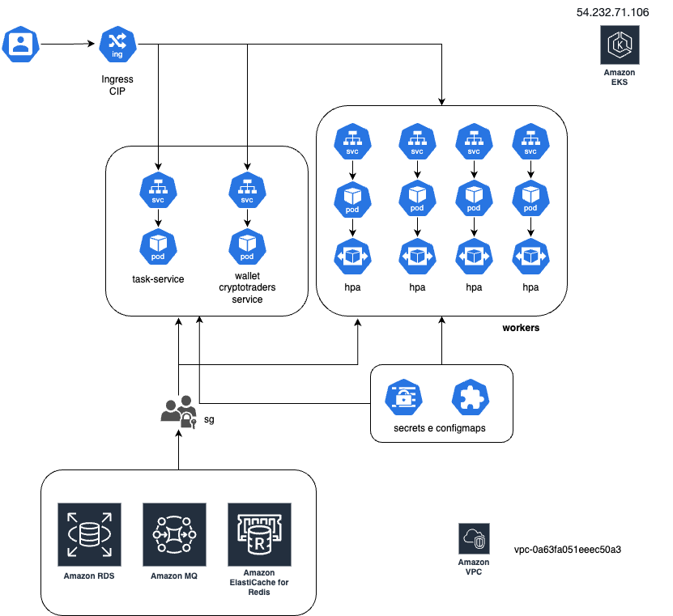

# Documentação do Cluster Kubernetes Financial-Move Tech

## Visão Geral

O cluster Kubernetes da **financial-move tech** está hospedado no **Amazon EKS** (Elastic Kubernetes Service), que proporciona:

- Escalabilidade automática.
- Gerenciamento simplificado de atualizações.
- Alta disponibilidade.
- Integração nativa com serviços AWS, como IAM, CloudWatch e Elastic Load Balancer (ALB).

As imagens dos workloads são armazenadas no **GitHub Container Registry (GHCR)** [ghcr financial-move](https://github.com/orgs/FinanciaI-Move/packages), oferecendo:

- Integração direta com pipelines de CI/CD.
- Controle de versão de imagens.
- Alto desempenho no pull de imagens.



---

## Estrutura de Rede

### Endereços IP

Os endereços IP de entrada e saída do cluster estão associados aos **Elastic IPs** configurados na AWS:

- **Elastic IPs de Entrada** [financial-move-cluster-production](http://k8s-prod-financia-48f4c3f817-1169813628.sa-east-1.elb.amazonaws.com): Configurados para o ALB gerenciado pelo ingress.
- **Elastic IPs de Saída** [54.232.71.106]: Associados aos nodes através de um NAT Gateway.

Para configurar novos IPs:

1. Acesse o console da AWS.
2. Navegue para **Elastic IPs** em **EC2**.
3. Aloque um novo IP e associe ao recurso desejado.

---

## Namespaces

### prod

O namespace `prod` é o principal ambiente de produção. Configurado em `namespaces/prod.yaml`:

```yaml
apiVersion: v1
kind: Namespace
metadata:
  name: prod
```

---

## Workloads

### Serviços Existentes

#### task-service

- **Deployment**: Definido em `deployment.yaml`.
- **Horizontal Pod Autoscaler (HPA)**: Configurado no `hpa.yaml` para escalabilidade.
- **Secret**: Detalhado no `secret.yaml`.
- **Service**: Configurado em `svc.yaml` para exposição interna e externa.

#### wallet-cryptotraders-service

- **Deployment**: Configurado no `deployment.yaml`.
- **Horizontal Pod Autoscaler (HPA)**: Definido no `hpa.yaml`.
- **Secret**: Detalhado em `secret.yaml`.
- **Service**: Configurado em `svc.yaml`.

#### Workers

Contém subdiretórios para diferentes tarefas:

- `order-history-worker`
- `pnl-worker`
- `user-order-worker`
- `user-wallet-composition`

Os secrets compartilhados estão no `secret.yaml`.

### Adicionando Novos Services ou Workers

1. **Criar Namespace (se necessário)**:

   - Edite o arquivo do namespace ou crie um novo em `namespaces/`.

   ```yaml
   apiVersion: v1
   kind: Namespace
   metadata:
     name: <namespace-name>
   ```

2. **Criar Deployment**:

   - Defina o deployment em `services/<service-name>/deployment.yaml`.

   ```yaml
   apiVersion: apps/v1
   kind: Deployment
   metadata:
     name: <service-name>
     namespace: <namespace>
   spec:
     replicas: 2
     template:
       spec:
         containers:
           - name: <container-name>
             image: ghcr.io/<repository>/<image>:<tag>
   ```

3. **Configurar HPA**:

   - Adicione o arquivo `hpa.yaml` para escalabilidade.

   ```yaml
   apiVersion: autoscaling/v2
   kind: HorizontalPodAutoscaler
   metadata:
     name: <hpa-name>
   spec:
     maxReplicas: 10
     metrics:
       - type: Resource
         resource:
           name: cpu
           target:
             averageUtilization: 70
     scaleTargetRef:
       apiVersion: apps/v1
       kind: Deployment
       name: <service-name>
   ```

4. **Criar Service**:

   - Defina o arquivo `svc.yaml` para roteamento interno ou exposição externa.

5. **Criar Secrets**:

   - Crie ou edite `secret.yaml` no diretório correspondente.

   ```yaml
   apiVersion: v1
   kind: Secret
   metadata:
     name: <secret-name>
   data:
     key: <base64-encoded-value>
   ```

6. **Configurar o Ingress**:
   - Adicione a rota no `ingress-services.yaml`.
   ```yaml
   - pathType: Prefix
     path: /<path>
     backend:
       service:
         name: <service-name>
         port:
           number: <port>
   ```

---

## Configuração de Roteamento do Ingress

O Ingress está configurado para utilizar um **AWS ALB**, com as seguintes rotas:

- `/service` → `task-service-svc` na porta `8000`.
- `/grafana` → `grafana` na porta `3000`.
- `/` → `wallet-cryptotraders-service-svc` na porta `5000`.

Exemplo de configuração:

```yaml
apiVersion: networking.k8s.io/v1
kind: Ingress
metadata:
  name: financial-move-ingress
  namespace: prod
  annotations:
    kubernetes.io/ingress.class: alb
    alb.ingress.kubernetes.io/scheme: internet-facing
    alb.ingress.kubernetes.io/target-type: ip
spec:
  rules:
    - http:
        paths:
          - pathType: Prefix
            path: /service
            backend:
              service:
                name: task-service-svc
                port:
                  number: 8000
```

---

## ConfigMaps

Definidos em `configmaps/configmap.yaml`. Usados para armazenar configurações:

```yaml
apiVersion: v1
kind: ConfigMap
metadata:
  name: app-config
data:
  APP_ENV: production
  DEBUG: "false"
```
