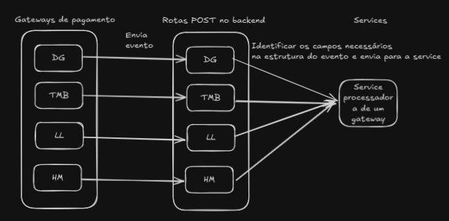

### Visão Geral

Este documento descreve o funcionamento do sistema de processamento de webhooks, que centraliza e padroniza a integração com diferentes gateways de pagamento e serviços externos. O sistema é projetado para lidar com eventos de compra, estorno e outras interações, oferecendo uma solução escalável e padronizada.

---

### Estrutura do Sistema

#### Rotas

As rotas são responsáveis por receber e validar os dados dos webhooks, encaminhando-os para a camada de serviços para processamento. Cada rota atende a um gateway ou serviço específico.

##### Rotas Principais

1. /digital (`payment_gateways.py`): Processa webhooks do gateway Digital Guru.

2. /tmb (`payment_gateways.py`): Processa webhooks do gateway TMB.

3. /curseduca (`curseduca.py`): Processa webhooks do sistema Curseduca.

4. /telegram (`telegram.py`): Processa notificações e comandos relacionados a bots no Telegram.

#### Camada de Serviços

A camada de serviços centraliza a lógica de processamento dos dados recebidos, garantindo a uniformidade e escalabilidade do sistema. A principal service utilizada é a `PaymentGatewayService`, que abstrai as operações comuns entre diferentes gateways.

##### Dados Recebidos pela Service

- Dados do cliente: `first_name`, `last_name`, `email`, `cpf`, `phone`.

- Dados do produto: `product_name`, `amount`, `validity_in_months`.

- Status do pagamento: "Efetivado" ou "Cancelado".

##### Fluxo de Processamento

1. Validação de Dados: Os dados recebidos são validados para garantir consistência.

2. Operações com Usuários: Verifica ou cria o usuário no banco de dados.

3. Operações com Produtos: Verifica ou cria o produto no banco de dados.

4. Registro de Transações: Cria ou atualiza transações no sistema, dependendo do status recebido.

##### Exemplo de Processamento de Webhook

1. A rota recebe um JSON do webhook.

2. Os dados obrigatórios, como email e nome do produto, são extraídos.

3. A rota encaminha esses dados para a `PaymentGatewayService`.

4. A service processa os dados, interage com o banco de dados e registra as informações necessárias.

5. A rota retorna uma resposta indicando sucesso ou erro.

---

### Detalhes dos Arquivos

#### 1. Arquivo `payment_gateways.py`

Define as rotas principais para integração com gateways de pagamento.

- Rota Digital Guru: Extraí dados como `email`, `produto` e `cpf` do JSON recebido e os encaminha para a `PaymentGatewayService`.

- Rota TMB: Processa os dados de forma similar, adaptada para o formato do gateway TMB.

- Rota LASTLINK: Processa os dados de forma similar, adaptada para o mesmo formato

- Rota Hotmart: Processa os dados de forma similiar, e adaptada para o formato semelhante.

#### 2. Arquivo `process_all.py`

Implementa a classe `ProcessAllPaymentGateways`, que centraliza a lógica de processamento.

##### Principais Funcionalidades

- Verifica ou cria usuários.

- Verifica ou cria produtos.

- Registra transações de pagamento ou estorno.

#### 3. Arquivo `curseduca.py`

Implementa uma rota para processar webhooks do sistema Curseduca, com foco em validação de email e chamada para o serviço `CurseducaService`.

#### 4. Arquivo `telegram.py`

Processa notificações e comandos recebidos por bots no Telegram, com integração aos serviços `BotChefeService` e `BotNormalService`.

---

### Escalabilidade e Adição de Novos Webhooks

O sistema é projetado para permitir a fácil integração de novos webhooks. Para adicionar um novo gateway ou serviço:

1. Crie uma nova rota no arquivo apropriado.

2. Extraia os dados necessários do JSON recebido.

3. Encaminhe os dados para a `PaymentGatewayService` ou outro serviço relevante.

---

### Conclusão

O sistema de webhooks oferece uma solução robusta e padronizada para integração com diferentes gateways de pagamento e serviços externos. Sua estrutura centralizada facilita a manutenção e permite escalabilidade para futuras integrações, garantindo maior organização e eficiência.
